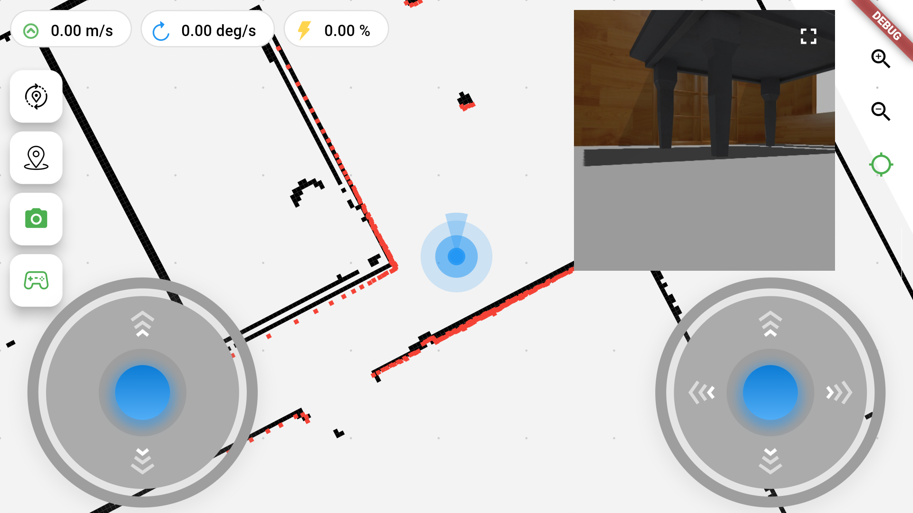
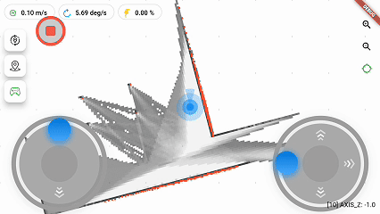
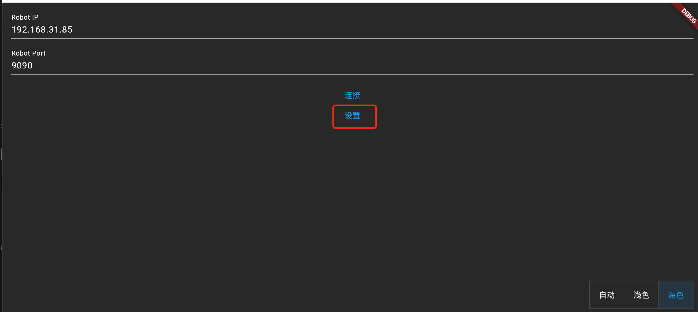
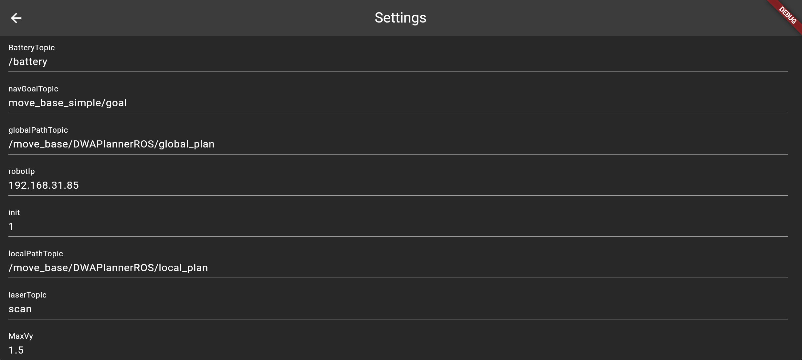

<a href="http://qm.qq.com/cgi-bin/qm/qr?_wv=1027&k=mvzoO6tJQtu0ZQYa_itHW7JrT0i4OCdK&authKey=exOT53pUpRG85mwuSMstWKbLlnrme%2FEuJE0Rt%2Fw6ONNvfHqftoWMay03mk1Qi7yv&noverify=0&group_code=797497206">

</a>


Cross-platform Flutter GUI human-machine interaction software implemented with ROS Bridge WebSocket
This project has integrated CI to ensure multi-environment availability and automatically packages multi-platform binary Release versions

*Table of Contents* 
<!-- TOC -->

- [1. User Guide](#1-user-guide)
  - [1.1 Download Project Release Package](#11-download-project-release-package)
  - [1.2 Running the Project](#12-running-the-project)
    - [1.2.1 Web Application Running Guide](#121-web-application-running-guide)
  - [1.3 Robot Environment Configuration](#13-robot-environment-configuration)
    - [ROS 1](#ros-1)
      - [Install rosbridge\_suite](#install-rosbridge_suite)
      - [Run rosbridge\_websocket](#run-rosbridge_websocket)
    - [ROS 2](#ros-2)
      - [Install rosbridge\_suite](#install-rosbridge_suite-1)
      - [Run rosbridge\_websocket](#run-rosbridge_websocket-1)
  - [1.4 Software Execution](#14-software-execution)
  - [1.5 Configuration Description](#15-configuration-description)
  - [1.6 Feature Description](#16-feature-description)
    - [1.6.1 Map Display](#161-map-display)
    - [1.6.2 Robot Position Display](#162-robot-position-display)
    - [1.6.3 Robot Speed Control](#163-robot-speed-control)
    - [1.6.4 Camera Image Display](#164-camera-image-display)
      - [ROS 1 Install web\_video\_server](#ros-1-install-web_video_server)
      - [ROS 2 Install web\_video\_server Tutorial](#ros-2-install-web_video_server-tutorial)
        - [1.5.3 Multi-point Navigation](#153-multi-point-navigation)
      - [Software Configuration](#software-configuration)
- [References](#references)
  - [License](#license)


*Project Screenshots*






Features/TODO:
  
| Feature                              | Status | Notes                                                                                                                       |
| ------------------------------------ | ------ | --------------------------------------------------------------------------------------------------------------------------- |
| ROS1/ROS2 Communication             | ✅      |                                                                                                                             |
| Map Display                          | ✅      |                                                                                                                             |
| Real-time Robot Position Display     | ✅      |                                                                                                                             |
| Robot Speed Dashboard                | ✅      |                                                                                                                             |
| Robot Manual Control                 | ✅      |                                                                                                                             |
| Robot Relocalization                 | ✅      |                                                                                                                             |
| Robot Single/Multi-point Navigation | ✅      |                                                                                                                             |
| Robot Global/Local Path Display      | ✅      |                                                                                                                             |
| Robot Topological Map Function       | ❌      |                                                                                                                             |
| Battery Level Display                | ✅      |                                                                                                                             |
| Map Editing Function                 | ❌      |                                                                                                                             |
| Robot Navigation Task Chain          | ✅      |                                                                                                                             |
| Map Loading                          | ❌      |                                                                                                                             |
| Map Saving                           | ❌      |                                                                                                                             |
| Camera Image Display                 | ✅      | Depends on [web_video_server](https://github.com/RobotWebTools/web_video_server.git). Web version not supported, others supported |
| Robot Body Outline Display           | ❌      | Supports custom vehicle body configuration                                                                                 |
| Layer Camera View Adjustment         | ✅      |                                                                                                                             |

  <picture>
    <source media="(prefers-color-scheme: dark)" srcset="https://api.star-history.com/svg?repos=chengyangkj/Ros_Flutter_Gui_App&type=Timeline&theme=dark" />
    <source media="(prefers-color-scheme: light)" srcset="https://api.star-history.com/svg?repos=chengyangkj/Ros_Flutter_Gui_App&type=Timeline" />
    
  </picture>

# 1. User Guide
## 1.1 Download Project Release Package

Download the required version for your environment (Windows, Linux, Web, Android) from the [Release page](https://github.com/chengyangkj/ROS_Flutter_Gui_App/releases).

## 1.2 Running the Project

Extract the downloaded package. Desktop applications can run directly after download. For web deployment, you need a web server. Here's how to use the web version:

### 1.2.1 Web Application Running Guide

Download the latest web version (ros_flutter_gui_app_web.tar.gz) from the [Release page](https://github.com/chengyangkj/ROS_Flutter_Gui_App/releases).  
Extract locally and deploy using Apache or other web servers.  

Enter the extracted directory:
```shell
cd ros_flutter_gui_app_web
```
Here we use Python to set up a simple web server:

```shell
python -m http.server 8000
```
Since port 8000 is specified here, enter `localhost:8000` in Google Chrome (other browsers not tested, may show blank page issues) to access the site.

## 1.3 Robot Environment Configuration

The software communicates with ROS through ROS Bridge WebSocket, so you need to install and run ROS Bridge WebSocket on your robot system first. Since ROS Bridge WebSocket implementation is compatible with both ROS1 and ROS2, installation tutorials are provided separately for ROS1 and ROS2.
 
### ROS 1

#### Install rosbridge_suite

1. **Ensure ROS 1 is installed** (e.g., ROS Melodic or ROS Noetic). If not, please refer to the [ROS Installation Guide](http://wiki.ros.org/ROS/Installation) for installation.

2. **Install the `rosbridge_suite` package**:

   ```bash
   sudo apt-get install ros-<your-ros-distro>-rosbridge-suite
   ```

   Replace `<your-ros-distro>` with your ROS version, such as `melodic` or `noetic`.

#### Run rosbridge_websocket

1. **Start ROS Core**:

   ```bash
   roscore
   ```

2. **In a new terminal, start the rosbridge_websocket node**:

   ```bash
   roslaunch rosbridge_server rosbridge_websocket.launch
   ```

3. **Verify that rosbridge_websocket is running**:

   Open a browser and navigate to `http://localhost:9090`. If the connection is successful, the WebSocket server is running.

### ROS 2

#### Install rosbridge_suite

1. **Ensure ROS 2 is installed** (e.g., ROS Foxy, Galactic, or Humble). If not, please refer to the [ROS 2 Installation Guide](https://docs.ros.org/en/foxy/Installation.html) for installation.

2. **Install the `rosbridge_suite` package**:

   ```bash
   sudo apt-get install ros-<your-ros2-distro>-rosbridge-suite
   ```

   Replace `<your-ros2-distro>` with your ROS 2 version, such as `foxy`, `galactic`, or `humble`.

3. **In each new terminal session, source your ROS 2 environment**:

   ```bash
   source /opt/ros/<your-ros2-distro>/setup.bash
   ```

#### Run rosbridge_websocket

1. **In a new terminal, start the rosbridge_websocket node**:

   ```bash
   ros2 launch rosbridge_server rosbridge_websocket_launch.xml
   ```

2. **Verify that rosbridge_websocket is running**:

   Open a browser and navigate to `http://localhost:9090`. If the connection is successful, the WebSocket server is running.

## 1.4 Software Execution

Open the software and configure topic settings:



Settings interface:


## 1.5 Configuration Description
|Configuration Name|Message Type|Description|
|---|---|---|
|battery_topic|sensor_msgs/BatteryState|Robot battery level topic, software subscribes |
|mapTopic|nav_msgs/OccupancyGrid|Robot map topic name, software subscribes |
|laserTopic|sensor_msgs/LaserScan| Laser topic name, software subscribes|
|localPathTopic|nav_msgs/Path|Robot local path topic name, software subscribes |
|globalPathTopic|nav_msgs/Path|Robot global path topic name, software subscribes |
|odomTopic|nav_msgs/Odometry|Robot odometry topic name, software subscribes |
|relocTopic|geometry_msgs/PoseWithCovarianceStamped|Robot relocalization topic name, software publishes |
|navGoalTopic|geometry_msgs/PoseStamped|Robot navigation goal topic name, software publishes |
|SpeedCtrlTopic|geometry_msgs/Twist|Robot speed control topic name, software publishes|
|maxVx|double|Maximum vx speed during manual control |
|maxVy|double|Maximum vy speed during manual control |
|maxVw|double|Maximum vw speed during manual control |
|mapFrameName|string|Map coordinate system TF frame name|
|baseLinkFrameName|string|Robot chassis coordinate system TF frame name|
|imagePort|string|Camera image web video server port|
|imageTopic|string|Camera image topic to display|
|imageWidth|int|Width of camera image to display, default 640|
|imageHeight|int|Height of camera image to display, default 480|
|ConfigTemplate|string|Template configuration, software initializes based on this template during upgrade and initialization. Supported types: ("turtlebot3:ros2","turtlebot3:ros1","jackal","turtlebot4","walking")|

After configuration is complete, click the connect button to connect to rosbridge_websocket. Upon successful connection, the software will automatically subscribe to the configured topics and display topic data:


## 1.6 Feature Description

### 1.6.1 Map Display

The software automatically subscribes to the configured map topic [mapTopic] and displays map data. Map data is displayed as a 2D grid on the interface. Clicking on grid cells shows the coordinates and values of the grid cells.

### 1.6.2 Robot Position Display

The software subscribes to ROS TF, manually builds the TF tree, and implements the tf2_dart class. Through the tf2_dart class, it can obtain the robot's position on the map and display it on the interface.

### 1.6.3 Robot Speed Control

The software automatically publishes the configured manual control speed [SpeedCtrlTopic] and displays robot speed control data. Clicking the speed control buttons on the interface allows you to control the robot's speed.
The left joystick controls robot speed: upper-left is positive direction, lower-right is negative direction, center is stop.
The right joystick controls both robot speed and rotation: upper-left is positive direction, lower-right is negative direction, left side rotates left, right side rotates right, center is stop.


### 1.6.4 Camera Image Display

Camera image display depends on the `web_video_server` package, which automatically converts all image topics in the system to MJPEG format HTTP video streams.

The following tutorials provide reference methods for installing and verifying this package in **ROS 1** and **ROS 2**.

#### ROS 1 Install web_video_server

1. **Install the `web_video_server` package**

   In **ROS 1**, run the following command to install the `web_video_server` package:

   ```bash
   sudo apt install ros-noetic-web-video-server
   ```

2. Start camera node

Start your camera node and ensure there are image topics.

3. Start web_video_server

Start the web_video_server node, which will publish image streams for web client access:

```bash
rosrun web_video_server web_video_server
```

4. Verify video stream

Open the following link in a web browser to view the video stream (assuming camera topic is /usb_cam/image_raw):

```bash
http://localhost:8080/stream?topic=/usb_cam/image_raw
```
If the image displays correctly, web_video_server has been successfully configured.

#### ROS 2 Install web_video_server Tutorial
Install web_video_server package

In ROS 2, you need to compile web_video_server from source code. First, ensure your workspace is initialized and set up:

```bash
mkdir -p ~/ros2_ws/src
cd ~/ros2_ws/src
git clone https://github.com/RobotWebTools/web_video_server.git
```
1. Install dependencies

Install required dependencies:

```bash
cd ~/ros2_ws/
rosdep install --from-paths src --ignore-src -r -y
```

2. Build workspace

Build the workspace using colcon:

```bash
colcon build
```

3. Start camera node

Start your camera node and ensure there are image topics.

4. Start web_video_server node:

```bash
ros2 run web_video_server web_video_server
```
4. Verify video stream

Open the following link in a web browser to view the video stream (assuming camera topic is /usb_cam/image_raw):

```bash
http://localhost:8080/stream?topic=/usb_cam/image_raw
```
If the image displays correctly, web_video_server has been successfully configured.

##### 1.5.3 Multi-point Navigation

Long press the left navigation point button to manage waypoints and perform multi-point navigation


#### Software Configuration

In the software, you need to configure the topic address to display and the web video server port (modify if changed, default is 8080):

The following items need to be configured:
- imagePort: Camera image web video server port
- imageTopic: Camera image topic to display
- imageWidth: Width of camera image to display, default 640
- imageHeight: Height of camera image to display, default 480

# References

- Some UI interface effects are referenced from [ros_navigation_command_app](https://github.com/Rongix/ros_navigation_command_app). Only UI display effects are referenced; all code implementation in this repository is original.
- [roslibdart](https://pub.dev/packages/roslibdart) implements ROS Bridge WebSocket communication in Flutter, enabling direct end-to-end communication with ROS.
- [matrix_gesture_detector](https://pub.dev/packages/matrix_gesture_detector) - The software's gesture recognition is based on this package.

## License

This project is licensed under the Creative Commons Attribution-NonCommercial-ShareAlike 4.0 International License. You are free to:

- **Share** — copy and redistribute the material in any medium or format
- **Adapt** — remix, transform, and build upon the material

Under the following terms:

- **Attribution** — You must give appropriate credit, provide a link to the license, and indicate if changes were made. You may do so in any reasonable manner, but not in any way that suggests the licensor endorses you or your use.
- **NonCommercial** — You may not use the material for commercial purposes. Permission from the author is required.
- **ShareAlike** — If you remix, transform, or build upon the material, you must distribute your contributions under the same license as the original.

For commercial use, please contact the author for authorization.

For more details, see the [LICENSE](./LICENSE) file.
